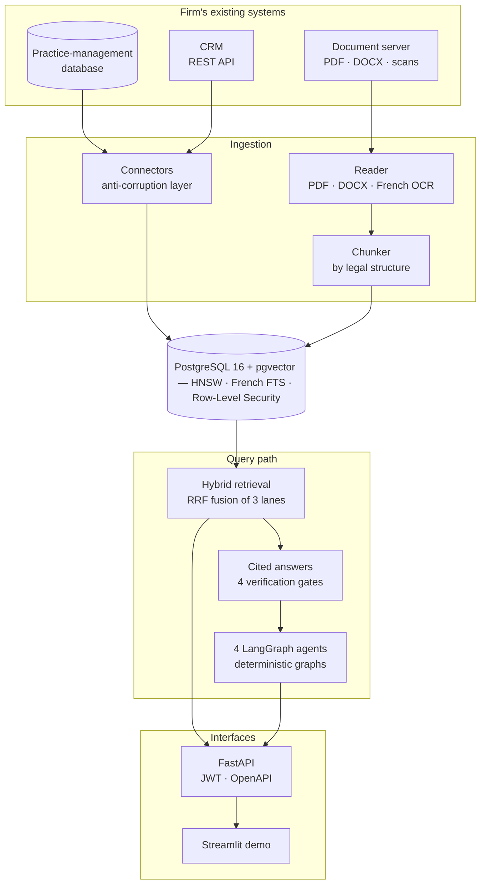
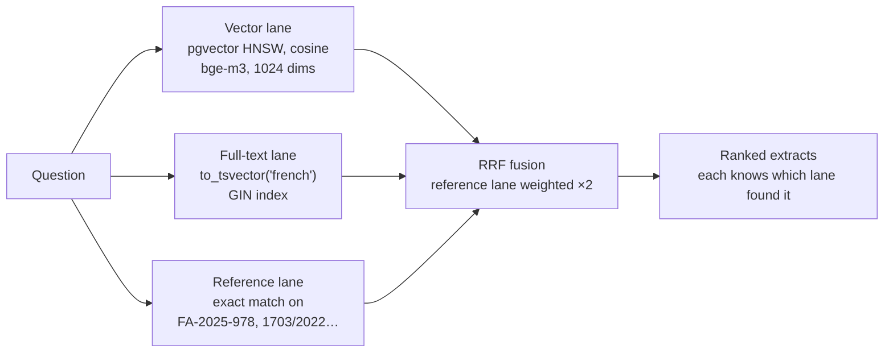
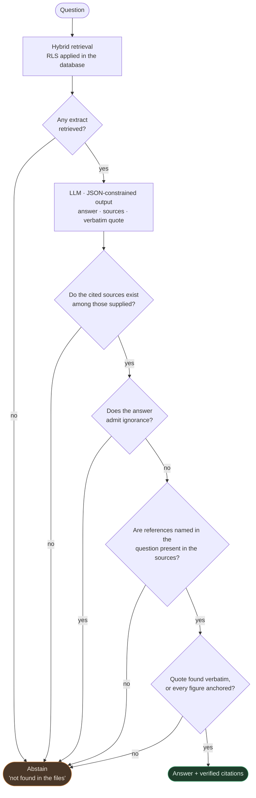
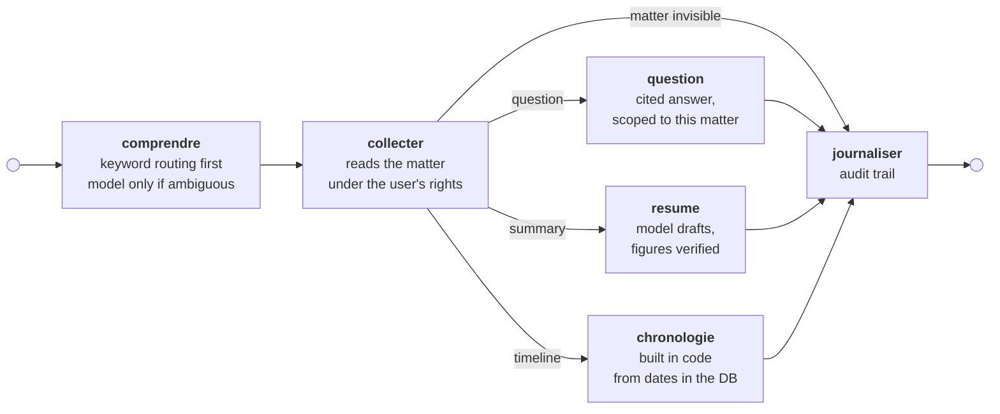
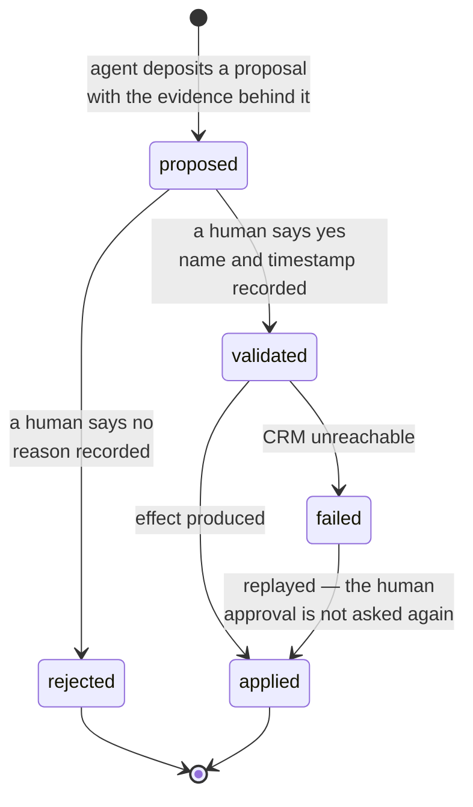
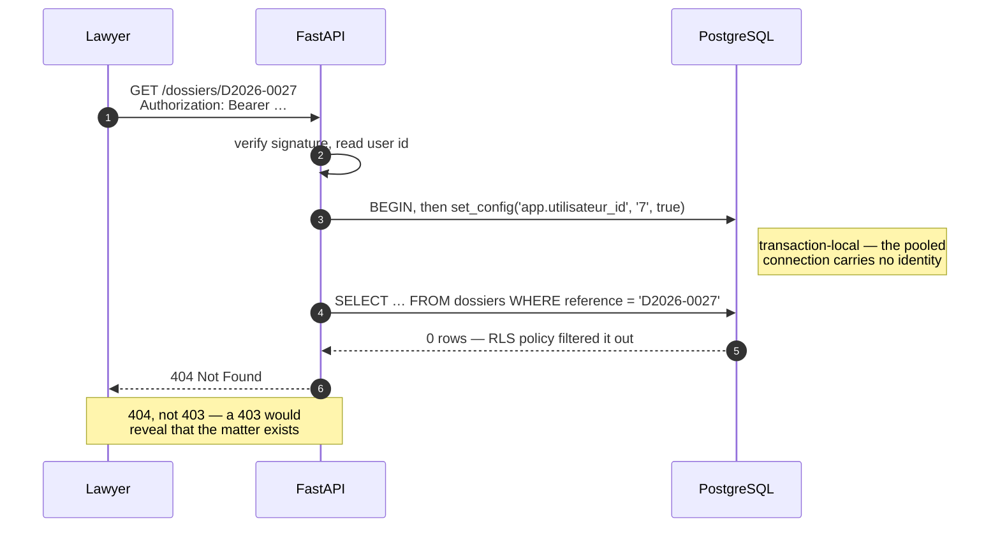
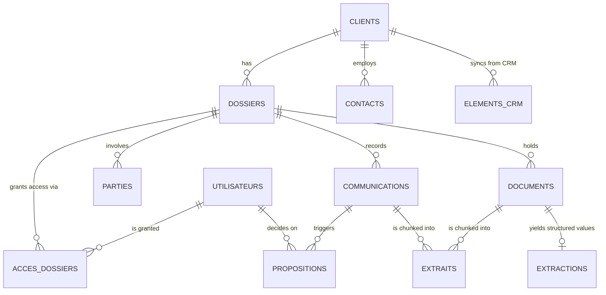

# JurisMind

**AI automation for a law firm — answers that cite their sources, or admit they don't know.**

[](https://github.com/Dioumadev221/jurismind/actions/workflows/qualite.yml)
[](https://www.python.org/)
[](https://github.com/pgvector/pgvector)
[](LICENSE)

JurisMind plugs into the systems a law firm already owns — its practice-management
database, its document server and its CRM — and turns twenty years of archives into
something it can actually query. Built for Senegalese and OHADA business litigation, it
runs end to end on a **laptop with no GPU** using local models, and switches to OpenAI
through a single environment variable.

The engineering problem is not retrieval. It is **knowing when not to answer**.

---

## Contents

- [The problem](#the-problem)
- [Architecture](#architecture)
- [How it works](#how-it-works)
  - [1 · Ingestion](#1--ingestion)
  - [2 · Hybrid retrieval](#2--hybrid-retrieval)
  - [3 · Answer verification](#3--answer-verification)
  - [4 · Agents](#4--agents)
  - [5 · Human-in-the-loop](#5--human-in-the-loop)
- [Data isolation](#data-isolation)
- [Data model](#data-model)
- [Measured results](#measured-results)
- [API surface](#api-surface)
- [Getting started](#getting-started)
- [Repository layout](#repository-layout)
- [Engineering decisions](#engineering-decisions)
- [Trade-offs and known limitations](#trade-offs-and-known-limitations)

---

## The problem

A firm has two decades of archives and no longer reads them. The questions that need
answering fast — *how long does the debtor have to file an opposition?*, *where do we stand
with this client?*, *which matter does this letter belong to?* — are answered somewhere in
the files, but finding the answer costs half an hour.

A naive assistant answers those questions. It also answers, with the same confidence, when
the answer is not in the files. In law, **a fabricated answer costs more than no answer at
all**: a wrong deadline loses an appeal, a wrong amount ends up in a filed pleading.

Three principles follow, and they shape every module:

| Principle | What it means in code |
|---|---|
| **Code computes, the model drafts** | Timelines, deadlines, matter routing and priorities are derived from the database by rules. The model only interprets a request and phrases a result. A date read from a table cannot be hallucinated. |
| **Nothing is displayed unverified** | Every answer carries citations, and the code checks that the cited sources exist, that each figure appears in the documents, and that quoted sentences are really there. When a check fails, the system abstains — and abstention is presented as a result, not as a failure. |
| **The database enforces permissions** | Isolation runs on PostgreSQL Row-Level Security. The application connects with an unprivileged role and every request executes under the user's identity. A badly written endpoint *cannot* leak another client's matter. |

---

## Architecture



**Stack** — Python 3.13 · PostgreSQL 16 + pgvector · SQLAlchemy 2 · Alembic · LangGraph ·
FastAPI · Streamlit · Tesseract OCR · Ollama or OpenAI · Docker.

---

## How it works

### 1 · Ingestion

Documents are read from the firm's file server, OCR'd when they are scans, and cut into
chunks along **legal structure** rather than at arbitrary character counts: article
boundaries, `PAR CES MOTIFS`, numbered clauses. Chunks target 1 100 characters with a
180-character overlap, and keep their page number so a citation can point at it.

Connectors are an **anti-corruption layer**: the legacy schema's quirks — duplicate client
records entered years apart, categories left at `DIVERS`, phone numbers in free text — are
translated at the boundary and never leak into the domain model. Synchronisation is
idempotent and re-runnable; it never overwrites a column the AI pipeline has filled.

### 2 · Hybrid retrieval

Three lanes run in parallel and are fused with **Reciprocal Rank Fusion** (*k* = 60):



The exact-reference lane matters more than it looks: a lawyer searching for invoice
`FA-2025-978` wants *that* invoice, not something semantically close to it. Vector search
alone reliably fails this case, which is why the lane carries double weight.

Permissions are applied **inside the database, before ranking** — not by filtering results
afterwards.

### 3 · Answer verification

This is the part that makes the output usable. The model is given retrieved extracts and
must return JSON: an answer, the source numbers it used, and a verbatim quote. Four gates
then run in code. Any failure means abstention.



Gate 4 is the one that catches the dangerous failures. A paraphrase is acceptable; an
invented amount never is. Every number in the answer — amounts, deadlines, dates — must be
found in the sources, compared after normalisation so that `13 750 000`, `13,750,000` and
`13.750.000 FCFA` are recognised as the same figure. Quote matching tolerates light
rewording through a 60 % significant-word overlap, measured on accent- and
punctuation-stripped text.

### 4 · Agents

Four agents, all built as **deterministic LangGraph state machines**. The graph decides the
steps; the model is called at most twice — once to interpret the request, once to phrase a
result. Letting a 3-billion-parameter model pick its own tools produces erratic, slow runs
and invents facts that a SQL query already knows.



| Agent | What it does | Model calls |
|---|---|---|
| **Matter assistance** | Question, summary, or timeline of a matter | 0–2 |
| **Client intelligence** | Profile, matters, exchanges, and **attention points** | 0–1 |
| **Document analysis** | Classifies the act, summarises it, extracts binding clauses | 3 |
| **Inbound mail triage** | Routes an email to a matter, sets priority, drafts a reply | 2 |

Attention points — *a deadline falling in nine days*, *a client letter unanswered for 32
days*, *extracted values flagged as doubtful* — are produced by **rules, never by a model**.
A model asked to worry always finds something to worry about; a rule points at the date that
triggered it. A timeline returns in **under a second** because no model is involved at all.

### 5 · Human-in-the-loop

Agents never act. They persist **proposals**; a human validates or rejects, and validation
is what produces the effect.



`validated` and `applied` are deliberately distinct states. Creating a CRM task crosses the
network: a human decision must not be lost because the CRM was down. Writes to the CRM are
retried **only on HTTP 429**, the one status where the server guarantees it did nothing — a
replayed `POST` on a timeout would create the task twice.

JurisMind sends no email. A validated draft is *approved for sending*; a human sends it.
That is a decision, not an omission.

---

## Data isolation

Permissions are not checked by application code. They are enforced by PostgreSQL policies,
with the user's identity set per transaction.



The policy itself is three lines of SQL, written by hand in the migration:

```sql
CREATE POLICY isolation ON dossiers USING (id IN (SELECT dossiers_autorises()));
CREATE POLICY isolation ON documents USING (dossier_id IN (SELECT dossiers_autorises()));
CREATE POLICY isolation ON clients   USING (id IN (SELECT client_id FROM dossiers));
```

The last line is the interesting one: because `dossiers` is itself filtered, **the client
policy cascades for free**. A client exists for a user only if that user can see at least
one of their matters — which is why the client profile field is named `dossiers_visibles`
and not `dossiers`.

Verified on real data: two lawyers see 43 and 26 matters, **zero overlap**. A matter outside
a user's scope returns 404 on its profile, its timeline *and* its agent endpoint.

**One deliberate exception.** The conflict-of-interest check bypasses RLS, because a
conflict is rarely found in your own matters — it is found in a colleague's. It is the only
place in the project that does so, it discloses the minimum (matter references are named
only if the requester already has access; the rest are counted), and every check is written
to the audit log. See [ADR 0009](docs/adr/0009-conflits-interets.md).

---

## Data model



`ACCES_DOSSIERS` is the whole of the permission model: one row per *(user, matter)* pair.
Every RLS policy in the schema resolves back to it.

`EXTRAITS` carries the `vector(1024)` column with an HNSW cosine index, plus a generated
`tsvector` column with a GIN index — one table serving both retrieval lanes, so a chunk can
never drift out of sync between them.

---

## Measured results

Every figure below is produced by a command in this repository, on a corpus of **433
documents** (135 of them scans read by OCR), **397 communications**, 69 matters and 40
clients. Model `qwen2.5:3b`, CPU only.

| Measurement | Result | Command |
|---|---:|---|
| Retrieval recall — 20 questions | **93.8 %** | `python -m jurismind.evaluation` |
| Correct abstention when the answer does not exist | **100 %** | *idem* |
| Answer accuracy when it does answer | 68.8 % | *idem* |
| Structured extraction accuracy — 98 fields, 30 acts | **100 %** | `python -m jurismind.evaluation.extraction` |
| … on OCR'd scans | **100 %** (85.7 % field coverage) | *idem* |
| Document classification — agreement with the firm's own filing | 75.5 % | `python -m jurismind.evaluation.classement` |
| … answers outside the closed 28-type vocabulary | **0 / 55** | *idem* |
| Tests | **323** | `pytest` |

**Read these numbers honestly.** Answer accuracy is 68.8 %, not 100 % — a small local model
still gets wording wrong. What *is* at 100 % is abstention: it does not answer when it does
not know, which is the property that makes the rest safe to deploy. On classification, 4 of
the 13 disagreements concern a distinction that **does not exist in the document** — whether
the firm or the opposing party filed it — leaving 7 genuine errors out of 53. The breakdown
is in the ADRs, including the cases that still fail.

---

## API surface

`uv run uvicorn jurismind.api.main:app --port 8000` — interactive docs at `/docs`.

| Method | Route | Purpose |
|---|---|---|
| `POST` | `/connexion` | Exchange credentials for a signed token |
| `POST` | `/recherche` | Hybrid search across documents and exchanges |
| `POST` | `/questions` | Cited answer, or abstention |
| `GET` | `/dossiers`, `/dossiers/{ref}`, `/{ref}/chronologie`, `/{ref}/documents` | Matter profile, timeline, exhibits |
| `POST` | `/dossiers/{ref}/assistant` | Matter-assistance agent |
| `GET` | `/clients/{id}`, `/{id}/dossiers`, `/{id}/echanges`, `/{id}/attention` | Client profile and attention points |
| `POST` | `/clients/{id}/assistant` | Client-intelligence agent |
| `GET` | `/documents/{id}`, `/{id}/texte`, `/{id}/extraction` | Exhibit, extracted text, structured values |
| `POST` | `/documents/{id}/analyse` | Document-analysis agent |
| `POST` | `/documents/{id}/extraction/validation` | A lawyer approves — or corrects — the extracted values |
| `POST` | `/courrier/tri` | Triage inbound mail into proposals |
| `GET` | `/propositions` | Pending decisions, most confident first |
| `POST` | `/propositions/{id}/validation`, `/rejet`, `/application` | Approve, reject, or replay |
| `POST` | `/conformite/verification` · `GET /conformite/balayage` | Conflict-of-interest checks |

Routes that invoke a model (`/questions`, `/*/assistant`, `/*/analyse`, `/courrier/tri`)
take 20–100 s on CPU. Routes that only read the database (`/*/chronologie`,
`/clients/{id}/attention`, `/propositions`) answer immediately.

Passwords are stored as salted `scrypt` digests and compared in constant time. Accounts
imported from the legacy system carry a digest no password can produce: they exist, and
cannot sign in until one is issued.

---

## Getting started

**Prerequisites** — Docker, [uv](https://docs.astral.sh/uv/), [Ollama](https://ollama.com),
and Tesseract with the French language pack for OCR.

```bash
# 1 · Database and dependencies
docker compose up -d
uv sync
cp .env.example .env

# 2 · Local models
ollama pull qwen2.5:3b && ollama pull qwen2.5 && ollama pull bge-m3

# 3 · The firm's "existing" systems — reproducible from a seed
uv run python -m simulation --taille small --seed 42
uv run uvicorn simulation.crm.app:app --port 8100 &

# 4 · JurisMind — schema, data sync, document ingestion
uv run alembic upgrade head
uv run python -m jurismind.connectors
uv run python -m jurismind.ingestion

# 5 · Demo accounts — passwords written to data/, outside the repository
uv run python -m jurismind.api.comptes --demo

# 6 · API and web interface
uv run uvicorn jurismind.api.main:app --port 8000
# http://localhost:8000      the interface
# http://localhost:8000/docs the OpenAPI documentation
```

No real data ships with this repository. The corpus is generated, but it imitates a real
system: technical identifiers, duplicate records, wrong categories, poorly scanned exhibits.

Command line, without the UI:

```bash
uv run python -m jurismind.agents dossier D2026-0024 "chronologie"
uv run python -m jurismind.agents client "Sine Services SA"
uv run python -m jurismind.agents document D2026-0024     # lists exhibits
uv run python -m jurismind.agents.courrier trier
uv run python -m jurismind.conformite balayer
```

---

## Repository layout

```
src/jurismind/
├── api/            FastAPI — token, routes, OpenAPI schemas
├── core/           configuration, shared text utilities
├── db/             SQLAlchemy models, sessions, RLS helpers
├── connectors/     legacy database and CRM — anti-corruption layer
├── ingestion/      reading, OCR, chunking, embeddings
├── retrieval/      hybrid search, permissions applied in the database
├── rag/            cited answers, verification gates, abstention
├── extraction/     Pydantic schemas, guided-JSON extraction
├── agents/         four LangGraph agents and the proposal lifecycle
├── conformite/     conflict-of-interest checks
├── web/            web interface — HTML, CSS and plain JS, served by the API
├── demo/           earlier Streamlit demo, kept while the interface settles
└── evaluation/     measurement harnesses
migrations/         Alembic, including hand-written RLS policies
simulation/         legacy database, fake CRM, document generator
docs/               design document and 9 ADRs
```

> **A note on language.** The codebase and design documents are written in French. The
> domain is Senegalese and OHADA law, where terms such as *mise en demeure*, *injonction de
> payer* or *dossier* have no exact English equivalent — translating them would cost
> precision in exchange for familiarity. Keeping the domain's own vocabulary is a deliberate
> choice, in the spirit of a ubiquitous language. This README, the API documentation and the
> commit history are the entry points for an English-speaking reader.

---

## Engineering decisions

Every non-obvious decision has an ADR recording what it fixed, what was measured, and what
was rejected.

| | Decision | The failure that prompted it |
|---|---|---|
| [0001](docs/adr/0001-connecteur-anticorruption-et-doublons.md) | Anti-corruption connector, cautious duplicate merging | three distinct companies merged into one |
| [0002](docs/adr/0002-rapprochement-crm.md) | CRM matching by ranked evidence | a prospect overwrote a client with a similar name |
| [0003](docs/adr/0003-verification-des-reponses.md) | Verify rather than trust | the model answered from world knowledge |
| [0004](docs/adr/0004-extraction-structuree.md) | Guided JSON over constrained generation | `with_structured_output` silently dropped amounts |
| [0005](docs/adr/0005-agents-deterministes.md) | Deterministic agent graphs | a timeline in under 1 s instead of 15 s, with nothing invented |
| [0006](docs/adr/0006-points-attention-regles.md) | Attention points computed by rules | a model asked to worry always finds something |
| [0007](docs/adr/0007-classement-et-releve-des-clauses.md) | Closed vocabulary, quoted clauses | 40 exhibits filed as `DIVERS`, and paraphrased clauses |
| [0008](docs/adr/0008-validation-humaine-en-base.md) | Approvals persisted, not `interrupt()` | approval arrives tomorrow, from someone else |
| [0009](docs/adr/0009-conflits-interets.md) | Conflicts: over-report rather than under-report | the firm acting against a company bearing a current client's name |

The full design document — actors, permission matrix, data model, ten-step plan — is in
**[docs/conception.md](docs/conception.md)**.

---

## Trade-offs and known limitations

Stated plainly, because a demonstration project that claims to be finished is lying.

- **Agent endpoints are synchronous** and take 20–100 s on CPU. In production they would go
  through the `taches` queue, which already exists in the schema.
- **No email is ever sent.** A validated draft is approved for sending; a human sends it.
- **Conflict checking is name-based.** It misses a company that changed its name, a
  subsidiary, or an individual directing two companies. A serious conflicts register needs
  the trade-register number on opposing parties — the schema does not carry it yet.
- **Salutations do not name the recipient.** Addressing someone in French requires a title,
  and the `contacts` table does not store one; inferring it from a first name is wrong about
  half the time.
- **Classification cannot resolve authorship.** Two of the firm's own categories encode *who
  filed* a document rather than *what it is*; no content-based classifier can recover that.

---

## License

MIT — see [LICENSE](LICENSE).
